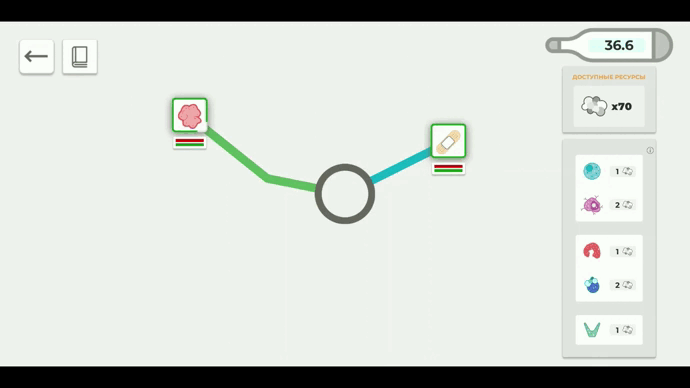
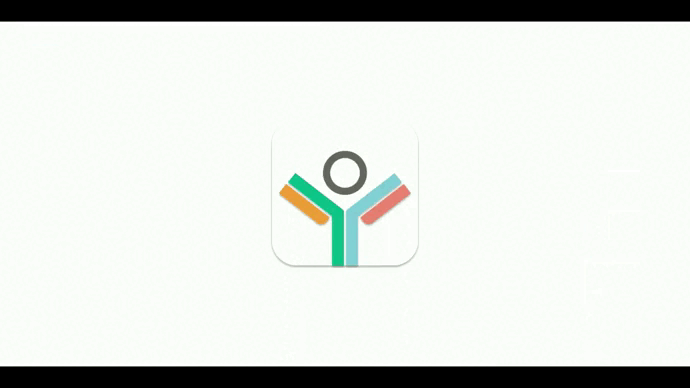

<h1 align="center">109Team. Игра про устройство иммунитета</h1>

---

    

---

## Описание

Формат: Игра для мобильных устройств на базе Android

Цель: формирование базовых знаний об устройстве человеческого иммунитета

Описание: игра в интерактивной форме повествует об устройстве человеческого иммунитета

Целевая аудитория:

- основная ЦА - молодые люди 18-25 лет, интересующиеся устройством человеческого организма и здоровьем
- побочная ЦА - люди любого возраста, которые не достаточно осведомлены об устройстве человеческого иммунитета

Основное преимущество: интеграция образовательной части в гемплей, актуальность

[Презентация игры](https://docs.google.com/presentation/d/19NMmtcf8O1uNR0XFQB2WeooieRAW9k6C/edit?usp=sharing&ouid=109201286991509934446&rtpof=true&sd=true)

[Отчет о разработке](https://docs.google.com/document/d/1IkdkOZ7fGgW8nL4UooLqlGcVABWKQou-/edit?usp=sharing&ouid=109201286991509934446&rtpof=true&sd=true)

[Игра для Android](https://drive.google.com/u/0/uc?id=1K4SieFjuEQEAJl7HAN7fKj_yaYjGT1Gk&export=download)

[Архив с игрой для PC](https://drive.google.com/u/0/uc?id=1EZGSFDKYIUV1Pz85cEeAGEMc-7cJX-Vb&export=download)

[Видеодемонстрация](https://drive.google.com/file/d/1z3g9JSq44uYzX_gRMfK4JFOM4wqGvPWy/view?usp=sharing)

## Демонстрация

### Свободная игра

### Обучение

## О проекте

Стек технологий: Unity 3D, C#, Figma

Сценарий использования:

1. Запустить игру
2.
    - Для новых игроков: перейти во вкладку "Обучение", пройти обучающий режим игры
    - Для обученных игроков: перейти во вкладку "Играть"
4. Играть в игру
5. В любой момент игры доступна вкладка с краткими справками о иммунных телах и угрозах для иммунитета

Структура проекта:

- __Assets__ _- директория, содержащая созданные для приложения медиа-файлы и написанные скрипты_
- __ProjectSettings__ _- служебная информацию Unity, настройки проекта_

## Запуск

Требования к ПО для использования:

- в процессе разработки: ПК с предустановленным Unity Editor 2020.3.11f1
- итоговый продукт: мобильное устройство на платформе Android 4.1 или новее (предпочтительно соотношение сторон экрана
  16:9)

Порядок установки:

- Игрового проекта в Unity:

1. клонировать репозиторий на устройство
2. запустить проект при помощи Unity Editor 2020.3.11f1

- Готового продукта для Android:

1. [скачать apk-файл](https://drive.google.com/u/0/uc?id=1K4SieFjuEQEAJl7HAN7fKj_yaYjGT1Gk&export=download)
2. открыть файл на устройстве и установить игру

- Готового продукта для ПК:

1. [скачать архив с игрой](https://drive.google.com/u/0/uc?id=1EZGSFDKYIUV1Pz85cEeAGEMc-7cJX-Vb&export=download)
2. распаковать архив
3. запустить файл Immunity Game.exe